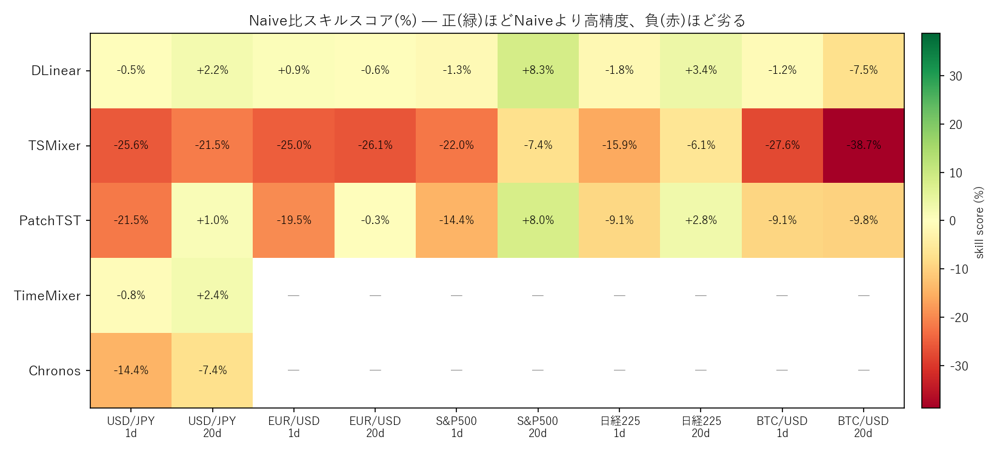
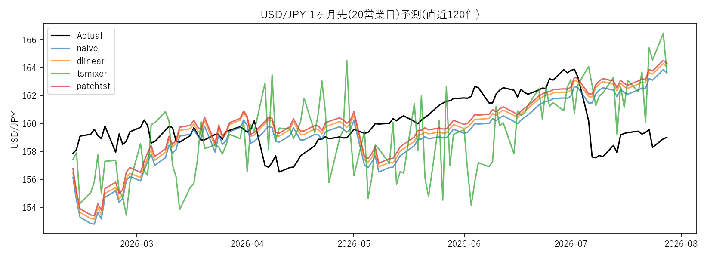

# ts-forecast-toolkit

金融時系列(為替・株価指数・暗号資産)の1期先/N期先予測手法を比較するための再利用可能なツールキット。

USD/JPY等を対象に「Naive・DLinear・TSMixer・PatchTST・TimeMixer・Chronos(ゼロショット基盤モデル)・ニュースセンチメント併用」を横断比較した実験(2026年8-9月)から、再利用できる部分をライブラリ化したもの。



*5資産(USD/JPY, EUR/USD, S&P500, 日経225, BTC/USD) × 2ホライズン(1日/20日)でのNaive比スキルスコア。短期(1日)ではほぼ全滅、長期(20日)ではDLinear/PatchTSTがボラティリティの低い資産(株価指数・USD/JPY)でNaiveを上回る一方、TSMixerは一貫して劣り、BTC/USDは20日先でも改善しない。*



*USD/JPY・20営業日(約1ヶ月)先予測の比較例。ホライズンが伸びるほどPatchTSTがNaiveより優位になる傾向を確認。*

## これまでの実験の要約

### 1. 基本セットアップ

- 対象: USD/JPY日次終値(後に多資産へ拡張)
- タスク: 過去30日の対数リターンから、N営業日先までの累積対数リターンを直接予測(Direct forecasting)。walk-forward評価(直近252日をテスト)
- 比較手法: Naive(前値据え置き) / ARIMA(1,1,1) / DLinear / TSMixer / PatchTST / TimeMixer(簡易自前実装) / Chronos(ゼロショット基盤モデル)

### 2. 主要な発見

| # | 実験 | 結果 |
| --- | --- | --- |
| 1 | USD/JPY・1日先 | **Naiveが最良**。複雑なモデル(TSMixer/PatchTST)はむしろ悪化。DLinearのみNaiveと僅差 |
| 2 | USD/JPY・1週間先/1ヶ月先(マルチホライズン) | ホライズンが伸びるほど**PatchTSTがDLinearを逆転**、Naiveとの差も拡大 |
| 3 | 5資産(為替2・株価指数2・暗号資産1)・1日先 | **全資産でNaiveが最良**。USD/JPYが偶然ではないことを確認 |
| 4 | 5資産・1ヶ月先 | 資産によって結果が逆転。**S&P500/日経225/USD/JPYはDLinearがNaiveを明確に上回る**が、**BTC/USDは依然Naiveが最良**(ボラティリティが高いほど複雑モデルが不利) |
| 5 | TimeMixer/Chronos追加(1日先・1ヶ月先) | TimeMixerはDLinearに近い挙動。Chronos(ゼロショット)は1日先で健闘するが1ヶ月先ではNaiveに劣化 |
| 6 | **USD/JPY・1ヶ月先・全6手法統合(現在の基本タスク)** | **PatchTSTが全手法中最良**(RMSE 2.5904 vs Naive 2.7320)。ただしskill score(誤差減少率を分散比で見た指標)は約10%に留まり、「予測が効いている」とまでは言い切れない水準 |
| 7 | 誤差の解釈 | Naiveの誤差 = 「その資産の当該ホライズンでの実際の変動幅(RMS)」と数学的に一致することを利用し、各手法の誤差を「変動幅に対する縮小率」として評価する枠組みを確立 |
| 8 | ランダム性の考察 | 完全なホワイトノイズではなく、「弱いトレンド構造(タイムシリーズ・モメンタム)がわずかに残る、ほぼランダムウォーク」という解釈が妥当。資産のボラティリティ特性とホライズンの組み合わせで予測可能性が変わる |
| 9 | ニュースセンチメント併用実験 | 進行中(下記「既知の課題・未完了タスク」参照) |

### 3. 各モデルの特性まとめ

| 手法 | 分類 | パラメータ数の目安 | 得意な条件 |
| --- | --- | --- | --- |
| DLinear | 線形(トレンド/季節性分解) | 数十 | ノイズが多い/短ホライズン。頑健で過学習しにくい |
| TSMixer | MLPミキシング | 数千 | 今回の実験では一貫して最下位。要ハイパーパラメータ調整 |
| PatchTST | パッチ化Transformer | 数万 | 長ホライズン。ホライズンが伸びるほど優位性が出た |
| TimeMixer | マルチスケール分解+ミキシング(簡易再現) | 数千 | DLinearに近い頑健さ |
| Chronos | ゼロショット基盤モデル | 学習なし | 短ホライズンで健闘するが長ホライズンでは劣化 |

## ディレクトリ構成

```
ts-forecast-toolkit/
├── src/
│   ├── models.py   # DLinear / TSMixer / PatchTST / TimeMixer / DLinearWithNews
│   ├── data.py     # yfinance取得、窓データ生成(Direct forecasting)
│   └── train.py    # 学習ループ・Naive/評価指標の共通処理
├── experiments/
│   ├── run_comparison.py   # 単一資産・任意ホライズンでの全手法比較
│   ├── run_chronos.py      # Chronosゼロショット評価
│   └── run_with_news.py    # ニュースセンチメント併用DLinear比較
├── news/
│   ├── fetch_alphavantage_news.py  # Alpha Vantage News & Sentiment API(疎サンプリング)
│   └── fetch_gdelt_tone.py         # GDELT DOC API(日次、2017年以降のみ)
└── requirements.txt
```

## 使い方

```bash
pip install -r requirements.txt

# 単一資産・1ヶ月先(20営業日先)で全手法比較
python experiments/run_comparison.py --ticker JPY=X --horizon 20 --out out/usdjpy_h20.json

# 別資産・別ホライズン
python experiments/run_comparison.py --ticker BTC-USD --horizon 1 --models dlinear,patchtst

# Chronosゼロショット評価(要 pip install chronos-forecasting)
python experiments/run_chronos.py --ticker JPY=X --horizon 20

# ニュースセンチメント取得(GDELT、2017年以降)
python news/fetch_gdelt_tone.py --start 2017-01-01 --end 2026-09-02 --out out/gdelt_tone_daily.csv

# ニュース併用比較
python experiments/run_with_news.py --ticker JPY=X --news-csv out/gdelt_tone_daily.csv --start 2017-01-01
```

## 既知の課題・未完了タスク

- **ニュースセンチメント併用実験は未完**:
  - Alpha Vantage: `topics=forex`は実在しないタグで無関係な記事が返っていたことが判明(正しくは`economy_monetary`等)。無料枠(1日25リクエスト程度)を検証で使い切ったため、正しいトピックでの疎サンプリング(20地点)は未実施
  - GDELT: DOC APIは無料・日次粒度で使えるが、2017年以前のデータは取得不可。かつレート制限(5秒に1回)を超えて一時的にIPブロックされ、ブロック解除待ちの状態で中断
  - 次にやること: GDELTのブロック解除を確認後 `news/fetch_gdelt_tone.py` を実行し、`experiments/run_with_news.py` で2017年以降のUSD/JPYに対して価格のみ/ニュース併用のDLinearを比較する
- TSMixer/PatchTSTのハイパーパラメータは今回の実験用に軽く決めた値のままで、正則化・early stopping等の調整余地が大きい
- skill scoreの統計的有意性は未検証(合成ランダムウォークとの比較、Ljung-Box検定などで「観測された数%の説明力が偶然でないか」を確認する余地あり)

## 参考文献

- Zeng, A. et al. "Are Transformers Effective for Time Series Forecasting?" AAAI 2023. (DLinear)
- Nie, Y. et al. "A Time Series is Worth 64 Words." ICLR 2023. (PatchTST)
- Wang, S. et al. "TimeMixer: Decomposable Multiscale Mixing for Time Series Forecasting." ICLR 2024.
- Ansari, A. et al. "Chronos: Learning the Language of Time Series." 2024. (Amazon)
